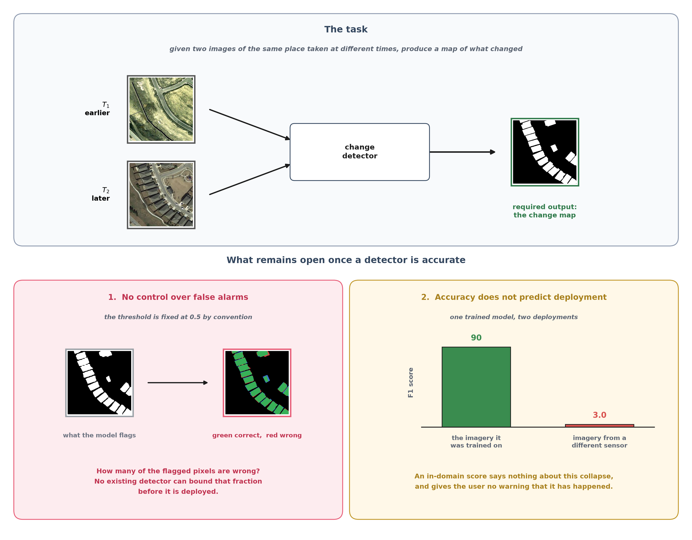
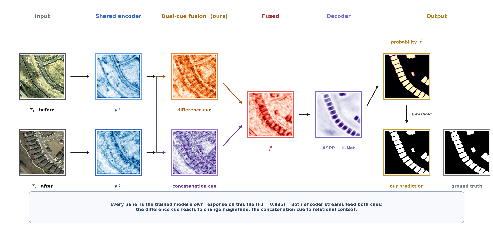

# DCFF-Net

**Dual-Cue Feature Fusion with Conformal Reliability for Efficient Remote Sensing Change Detection**

Official implementation. Manuscript submitted to *Pattern Analysis and Applications* (Springer).

Abdulkadhem A. Abdulkadhem — Department of Artificial Intelligence, College of Sciences,
Al-Mustaqbal University, Hillah, Babil, Iraq — <a.abdulkadhem@uomus.edu.iq>

---

> **The manuscript is not in this repository.** It is under review; this
> repository carries the code, the results and the figures. Everything
> needed to reproduce every number is here.

---

## What this repository gives you

Two things, and they are independent. You can take either without the other.

**1. An accurate convolutional change detector.** 13.6 M parameters, no attention,
no transformer, no state-space scan. It beats a reproduced FC-Siam-Diff baseline on
five public benchmarks and reaches parity with far heavier transformer and
state-space models on the protocol-matched ones. It is *not* the smallest detector
in the literature — TinyCD reaches comparable accuracy at a fiftieth of the size —
so the efficiency claim here is against the transformer family only.

**2. A reliability layer that works on any change detector, including yours.**
Given a model that outputs a probability map, it calibrates a single threshold so
that the **expected per-image false-discovery proportion on unseen data is
provably at most α**, with no assumption about the data distribution. If no
threshold can honour the budget, it says so and abstains rather than issuing a
certificate it cannot support.

The second point is the one most likely to be useful to other people's work. It is
post-hoc, training-free and model-agnostic: about forty lines of numpy applied to
whatever probability maps your model already produces.



*The task, and the two things an accurate detector still fails to tell its user.*

---

## What the model actually does



*One LEVIR-CD tile pushed through the trained model. Every panel is the model's
own response: the difference cue reacts to change magnitude and lights up the
replaced buildings, the concatenation cue holds the surrounding context, and the
fused feature sharpens the changed footprints the decoder then isolates.*

---

## Results

In-domain test F1. Both models trained by us under an identical protocol, one
shared recipe with no per-dataset tuning.

| Dataset | FC-Siam-Diff (reproduced) | **DCFF-Net** | Δ |
|---|---|---|---|
| LEVIR-CD (+MS-TTA) | 85.31 | **90.69** | +5.4 |
| SYSU-CD | 79.24 | **83.57** | +4.3 |
| EGY-BCD | 68.10 | **81.39** | +13.3 |
| CLCD | 50.46 | **77.25** | +26.8 |
| DSIFN-CD | 57.31 | **67.61** | +10.3 |

Conformal-FDR on LEVIR-CD, calibrated on validation and evaluated once on test:

| Target α | Threshold λ̂ | Realised test FDP | Recall | Guarantee |
|---|---|---|---|---|
| 0.05 | 0.780 | **0.045** | 0.756 | held |
| 0.10 | 0.080 | **0.097** | 0.835 | held |
| 0.20 | 0.020 | **0.125** | 0.852 | held |
| fixed 0.50 | 0.500 | 0.059 | 0.791 | none |

At α ≥ 0.10 the certified threshold reaches **higher recall than the default 0.5
threshold** while also bounding false alarms. The conventional threshold is not
merely unguaranteed here; it is dominated.

### What we do not claim

We are not the accuracy state of the art and we do not present ourselves as such.
On LEVIR-CD we trail ChangeTitans by 0.83 F1. On SYSU-CD our two-seed mean is
82.89 ± 0.96, which sits among ChangeTitans (83.24), ChangeMamba (83.11), CFNet
(82.87) and TransY-Net (82.84) rather than above them — we report the mean rather
than our better run (83.57) because the seed spread is as large as the margin
separating those four methods. Our CLCD copy is a 256-crop re-split and is **not**
comparable with published CLCD numbers. On EGY-BCD and DSIFN-CD we remain below
published results and make no competitiveness claim.

The claim is parity with the transformer and state-space family at a parameter
count we report and most of them do not, plus a guarantee none of them offers.

---

## Install

```bash
git clone https://github.com/Abdulkadhem/DCFF-Net.git
cd DCFF-Net
pip install -r requirements.txt
```

CPU is enough for evaluation and for the conformal layer. Training wants a GPU.
Tested on Python 3.11–3.13, PyTorch 2.0–2.13, Linux and Windows.

---

## Five-minute check

Download a checkpoint from the [Releases](../../releases) page into `weights/`, then:

```bash
python code/eval_local.py --ckpt weights/dcff_final_best.pt
```

Expected, exactly:

```
[RESULT] P=0.8948 R=0.9057 F1=0.9002 IoU=0.8185
```

That is the 90.02 / 81.85 of Table 1. The LEVIR-CD test split downloads on first
use and is cached. On a laptop CPU this takes roughly ten minutes.

---

## Using the conformal layer on your own model

This is the part that does not need our architecture. You need one thing: a
function that turns an image pair into a probability map in `[0, 1]`.

```python
import numpy as np
from conformal_fdr import crc_threshold

# 1. On held-out images, count what each candidate threshold would cost.
#    fdp[i, j] = false-discovery proportion of image i at threshold lambdas[j].
lambdas = np.linspace(0.0, 1.0, 101)
fdp = np.zeros((len(calib_images), len(lambdas)))
for i, (t1, t2, y) in enumerate(calib_images):
    p = your_model(t1, t2)                      # any model, any framework
    for j, lam in enumerate(lambdas):
        pred = p > lam
        tp = (pred & y).sum()
        fp = (pred & ~y).sum()
        fdp[i, j] = fp / (tp + fp) if (tp + fp) else 0.0

# 2. Certify a threshold for the budget you choose.
#    Returns (grid index, threshold, empirical risk curve); the first two are
#    None when no threshold can honour the budget.
idx, lam_hat, risk = crc_threshold(fdp, lambdas, alpha=0.10)

if lam_hat is None:
    print("no threshold can honour alpha=0.10 on this data — abstaining")
else:
    print(f"use threshold {lam_hat:.3f}; E[FDP] on exchangeable test data <= 0.10")
```

Two things are worth understanding before relying on it.

**The guarantee holds under exchangeability**, meaning the calibration images and
the images you deploy on must be drawn alike. That is a real condition, not a
formality. Calibrate on one city and deploy on another with a different sensor and
the bound can fail.

**The failure is informative.** We measured how it fails: the gap between realised
and target error grows with the size of the distribution shift. Calibrating on a
matched split gives a valid certificate or an honest abstention; calibrating on a
shifted split gives a certificate whose gap tells you how far the data has moved.
Section 5.5 of the paper reports this across three datasets. In practice,
calibrating on a held-out slice of the *target* data is both the correct procedure
and the one that works.

---

## Reproducing the paper

Every number and every figure regenerates from this repository. The commands below
are the ones that produced them.

### Training

```bash
python code/train.py --dataset levir --model dcff --fusion dual \
  --no_cbam --no_boundary --batch 16 --lr 6e-4 --epochs 100 \
  --tag levir_dcff --out results
```

`--dataset` accepts `levir`, `sysu`, `egy`, `clcd`, `dsifn`. Each run writes a
`*_result.json` with the full argument set, parameter count and metrics, plus a
training log. Roughly four hours on one RTX 3090 for LEVIR-CD at 100 epochs.

### Evaluation

```bash
python code/eval_local.py --ckpt weights/dcff_final_best.pt                    # 90.02, Table 1
python code/eval_mstta.py --ckpt weights/dcff_final_best.pt --dataset levir    # 90.69, adopted
python code/eval_cross.py --ckpt weights/dcff_final_best.pt                    # zero-shot, Sec. 6.1
```

### The reliability layer

```bash
python code/conformal_prep.py --ckpt weights/dcff_final_best.pt   # per-image FDP counts
python code/conformal_fdr.py                                      # Table 4
python code/conformal_multi.py --dataset egy --ckpt weights/egy_dcff_best.pt   # Table 5
```

### Figures

```bash
python paper/extract_flow_assets.py     # runs the model, saves the intermediate maps
python paper/make_problem.py            # Fig 1
python paper/make_architecture_v2.py    # Fig 2
python paper/make_dualcue_v2.py         # Fig 3
python paper/make_dualcue_scales.py     # Fig 4
python paper/make_training_curve.py     # Fig 5
python paper/make_figures.py            # Figs 6, 7, 9, 14
python paper/make_curves_v2.py          # Figs 8, 15
python paper/make_ablation_curves.py    # Figs 10, 11
python paper/make_conformal_multi.py    # Fig 13
python code/make_qualitative.py  --ckpt weights/dcff_final_best.pt             # Figs 16–18
python code/qualitative_multi.py --dataset egy --ckpt weights/egy_dcff_best.pt # Figs 19–20
```

Figure numbers above are the ones used in the paper. `paper/figures/` holds the
same images under descriptive names.

---

## Data

Five public benchmarks, downloaded on demand through 🤗 `datasets` and cached:

| Short name | Dataset | HuggingFace id | Train / Val / Test |
|---|---|---|---|
| `levir` | LEVIR-CD | `ericyu/LEVIRCD_Cropped_256` | 7120 / 1024 / 2048 |
| `sysu` | SYSU-CD | `ericyu/SYSU_CD` | 12000 / 4000 / 4000 |
| `egy` | EGY-BCD | `ericyu/EGY_BCD` | 3654 / 1219 / 1218 |
| `clcd` | CLCD | `ericyu/CLCD_Cropped_256` | 1440 / 480 / 480 |
| `dsifn` | DSIFN-CD | `EVER-Z/torchange_dsifn-cd` | 3600 / 340 / 48 |

Our LEVIR-CD, SYSU-CD and DSIFN-CD splits reproduce the standard partitions, so
those numbers are directly comparable with published work. The CLCD copy is a
256-crop re-split and is not.

No path is hardcoded anywhere in `code/`. Everything resolves through
[`code/paths.py`](code/paths.py), which you can override:

```bash
export DCFF_DATA=/mnt/big-disk/hf_cache      # where datasets live
export DCFF_WEIGHTS=/mnt/big-disk/weights    # where checkpoints live
```

---

## Checkpoints

Trained weights are published on the [Releases](../../releases) page, not in git
(52 MB each). Download the one you need into `weights/`.

| File | Dataset | Test F1 | Use it for |
|---|---|---|---|
| `dcff_final_best.pt` | LEVIR-CD | 90.02 (90.69 +MS-TTA) | the headline result, the conformal tables, all LEVIR figures |
| `sysu_dcff_best.pt` | SYSU-CD | 83.57 | the protocol-matched comparison |
| `egy_dcff_best.pt` | EGY-BCD | 81.39 | cross-dataset soundness |
| `clcd_dcff_best.pt` | CLCD | 77.25 | the imbalanced-data case |
| `dsifn_dcff_best.pt` | DSIFN-CD | 67.61 | the hard case, where the layer abstains |

Every checkpoint is a plain `state_dict` for `DCFFNet(backbone="resnet18",
use_cbam=False, use_aspp=True)`. Nothing else is needed to load one:

```python
import torch
from models import DCFFNet

net = DCFFNet(backbone="resnet18", pretrained=False, use_cbam=False, use_aspp=True).eval()
net.load_state_dict(torch.load("weights/dcff_final_best.pt", map_location="cpu"))
```

---

## Repository layout

```
code/
  paths.py             every data and checkpoint location, and nothing else
  models.py            DCFFNet, DualCueFusion, ASPP, the FC-Siam baseline
  data_cd.py           one loader for all five datasets
  train.py             training entry point
  eval_local.py        plain evaluation
  eval_mstta.py        multi-scale test-time augmentation (the adopted result)
  eval_cross.py        zero-shot cross-dataset transfer
  conformal_prep.py    per-image false-discovery counts
  conformal_fdr.py     the conformal threshold, and Table 4
  conformal_multi.py   cross-dataset soundness, Table 5
  soup.py              model soup — a reported negative result, kept for the record
  make_qualitative.py  qualitative panels
  qualitative_multi.py the same for EGY-BCD and DSIFN-CD

paper/
  figures/             every figure in the paper, as generated
  figstyle.py          shared drawing primitives for the diagrams
  make_*.py            one script per figure
  extract_*.py         run the model and dump the intermediate maps the figures use
  tables.md            every table, with the caveats attached
  equations.md         the 13 equations, each pointing at the code that implements it
  results_log.md       chronological record of every experiment, failures included

results/               *_result.json and training logs for every run in the paper
```

Every file in `code/` produces something that appears in the paper. Scripts that
did not survive into the manuscript were removed rather than left lying around.

---

## Reproducibility

Seeds are fixed at 42; the SYSU-CD variance study additionally uses 7. Each run
writes its complete configuration next to its metrics, so a `*_result.json` in
`results/` is enough to reconstruct the command that produced it.

We also report what did not work. Seven independent avenues for further accuracy
were probed and six failed — longer schedules, remote-sensing self-supervised
pretraining, Lovász-hinge training, Lovász polishing, model soup and FixRes
fine-tuning. Only multi-scale test-time augmentation helped, and by 0.67 F1.
Table 6 of the paper lists all seven. Two of the failures are worth knowing about:
Sentinel-2 self-supervised pretraining transfers *worse* than ImageNet for 0.5 m
aerial change detection, which suggests that matching resolution matters more than
matching nominal domain; and model soup collapses across independently initialised
runs, which do not share a loss basin.

---

## Citation

```bibtex
@article{abdulkadhem2026dcffnet,
  title   = {{DCFF-Net}: Dual-Cue Feature Fusion Model with Conformal Reliability
             for Efficient Remote Sensing Change Detection},
  author  = {Abdulkadhem, Abdulkadhem A.},
  journal = {Pattern Analysis and Applications},
  year    = {2026},
  note    = {Under review}
}
```

If you use the conformal layer, please also cite the risk-control result it rests on:

```bibtex
@inproceedings{angelopoulos2024conformal,
  title     = {Conformal Risk Control},
  author    = {Angelopoulos, Anastasios N. and Bates, Stephen and Fisch, Adam
               and Lei, Lihua and Schuster, Tal},
  booktitle = {International Conference on Learning Representations},
  year      = {2024}
}
```

---

## License

[MIT](LICENSE). The datasets keep their own licenses; see the sources listed above.

## Contact

Questions, bug reports and reproduction failures are all welcome as
[issues](../../issues). If a number in the paper does not reproduce for you, please
open one — we would rather know.
